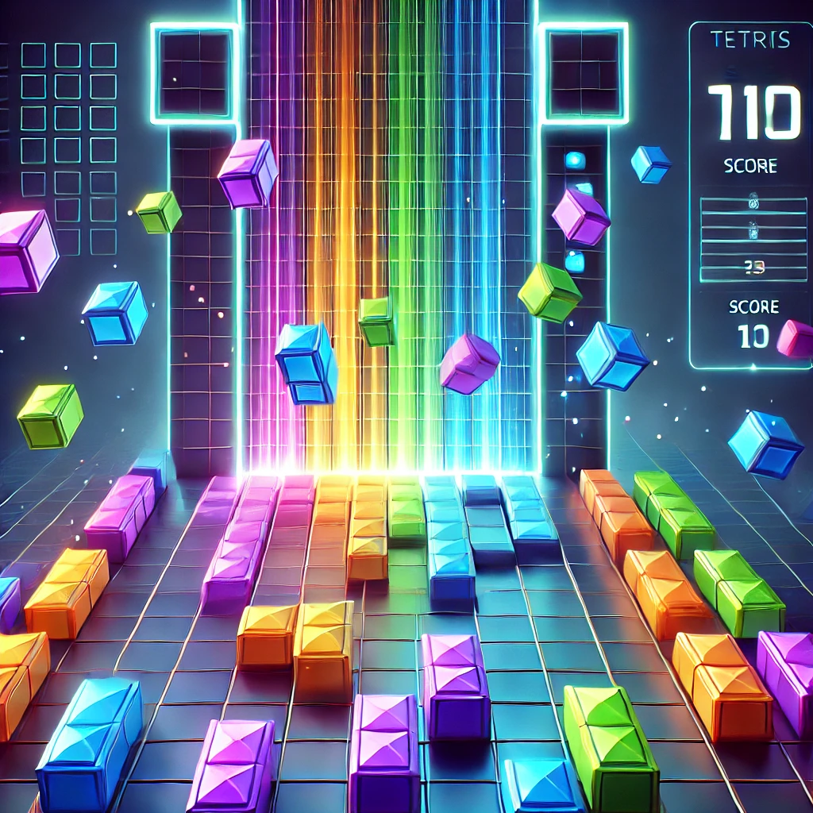

# **TetriSpin**



Welcome to **TetriSpin**, a modern twist on the classic Tetris game! Built using HTML, CSS, JavaScript, and the Canvas API, this game offers smooth gameplay, colorful visuals, and an interactive grid system. The objective is simple: stack and clear rows of blocks as they fall, rotating and shifting them to fit together perfectly. But watch out — the pieces will keep coming faster!

## **Features**
- **Dynamic Piece Movement**: Rotate, move, and drop pieces using your keyboard arrows.
- **Canvas-Based Rendering**: Smooth rendering of pieces and grid using the Canvas API.
- **Responsive Score System**: Earn points as you clear rows, with increasing rewards for multiple row clears at once.
- **Game Over Detection**: The game ends when the stack of pieces reaches the top of the grid.
- **Grid Updates**: The grid updates as rows are cleared and new pieces spawn.

## **Controls**
- **Arrow Up**: Rotate the piece.
- **Arrow Down**: Move the piece down faster.
- **Arrow Left**: Move the piece left.
- **Arrow Right**: Move the piece right.

## **Technologies Used**
- **HTML5**: Structure of the game interface.
- **CSS3**: Styling for the game and scoreboard.
- **JavaScript**: Core game logic and interactions.
- **Canvas API**: Rendering the pieces and grid on the screen.

## **How to Play**
1. Download or clone this repository.
2. Open the `index.html` file in your browser to start playing the game.
3. Control the falling pieces using your arrow keys, rotate and align them to fill rows.
4. Earn points by clearing rows — the more rows you clear at once, the higher the score!
5. Try to beat your high score, and don't let the pieces stack to the top!

## **Setup**
1. Clone the repository:
    ```bash
    git clone https://github.com/Flames004/TetriSpin.git
    ```
2. Open `index.html` in your preferred browser.

## **Future Enhancements**
- Adding sound effects and music.
- Implementing difficulty levels.
- Introducing new types of blocks and shapes.

## **Featues to be added in new update**
- High score monitor
- Dark Mode
- Changing controls
- Animations

## **License**
This project is open-source under the MIT License.
